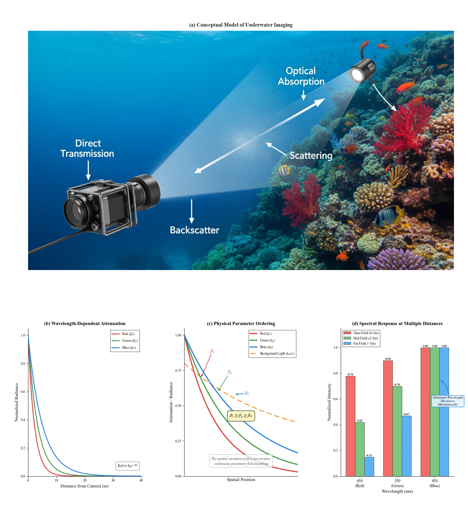

# PINE
Physics-Informed Neural Enhancement for Underwater Video via Implicit Representation

Dr. Jinxin SHAO
2025/10/29

google dirve: https://drive.google.com/file/d/1o4hoxZ1zBW1VEYeTqmAIkhd5wECrUkYV/view?usp=drive_link

<h2>Qualitative Video Comparisons</h2> 

This section presents qualitative comparisons among our method (PINE), the input video (Blur), and the ground-truth approach (LANet) from the UVEB dataset.

<table style="width:100%; border:0;">
  <tr style="text-align: center; border:0;">
    <th>输入 (Input)</th>
    <th>LANet (CVPR 2022)</th>
    <th>PINE (ISPRS 2025 Ours)</th>
  </tr>
  
  <tr style="text-align: center; border:0;">
    <td>
      <video autoplay loop muted playsinline width="100%">
        <source src="videos/cv_1000_blur.mp4" type="video/mp4">
      </video>
    </td>
    <td>
      <video autoplay loop muted playsinline width="100%">
        <source src="videos/cv_1000_LANet.mp4" type="video/mp4">
      </video>
    </td>
    <td>
      <video autoplay loop muted playsinline width="100%">
        <source src="videos/cv_1000_enhanced.mp4" type="video/mp4">
      </video>
    </td>
  </tr>
</table>
